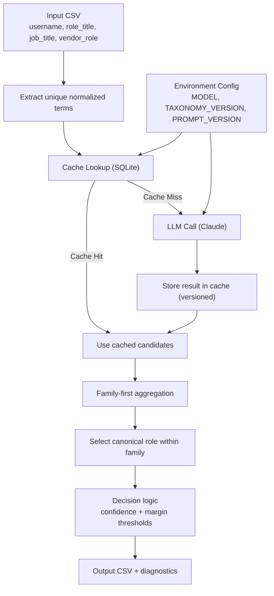

# Role Taxonomy Ensemble Engine

A hierarchical, LLM-powered role taxonomy classifier for multi-field role harmonization in enterprise datasets.

This system classifies free-form role titles into a controlled canonical taxonomy using a multi-field ensemble approach with persistent caching to minimize API cost.

---

## Features

- Multi-field classification (`role_title`, `job_title`, `vendor_role`)
- Top-3 candidate extraction per field
- Family-first hierarchical scoring
- Weighted ensemble aggregation
- Confidence + margin-based review logic
- Versioned persistent SQLite cache
- CSV input/output pipeline

---

## Project Structure

```
|-- role-taxonomy-ensemble/
|-- README.md
|-- requirements.txt
|-- taxonomy_roles.csv
|-- input_records.csv
|
|-- src/
|   |-- role_taxonomy_ensemble.py
|
|-- experiments/
|   |-- claude_test.py
```


---

## Taxonomy

Canonical roles and family mappings are stored in `taxonomy_roles.csv`.

This allows taxonomy updates without modifying application code.

Family classification is deterministic via mapping from canonical roles.

---

## Caching & Cost Optimization

The system uses a persistent SQLite cache (`cache.sqlite`) to avoid repeated LLM calls.

- Each unique normalized term is scored once.
- Results are versioned by:
  - Model (`ANTHROPIC_MODEL`)
  - Taxonomy version (`TAXONOMY_VERSION`)
  - Prompt version (`PROMPT_VERSION`)
- Changing any version triggers automatic cache invalidation.

This reduces API usage from: O(records × fields) to: O(unique_terms).


---

## Configuration

Configuration is externalized via environment variables:

- `ANTHROPIC_API_KEY`
- `ANTHROPIC_MODEL`
- `TAXONOMY_VERSION`
- `PROMPT_VERSION`

This enables reproducibility and model switching without code changes.

---

## How to Run

1. Install dependencies:

```bash
pip install -r requirements.txt
```

2. Create a .env file with:
ANTHROPIC_API_KEY=your_key_here
ANTHROPIC_MODEL=claude-haiku-4-5
TAXONOMY_VERSION=v1
PROMPT_VERSION=v1

3. Run:
```bash
python src/role_taxonomy_ensemble.py
```
Output will be written to a CSV file in the project root.

---

## Architecture

See system design diagram below.

