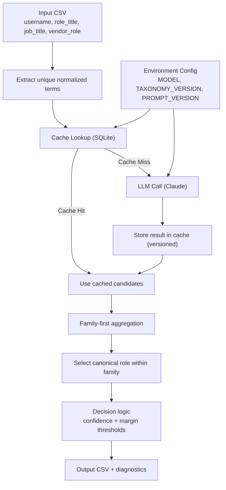

# Role Taxonomy Ensemble Engine

Hierarchical LLM-powered role taxonomy classifier for multi-field role harmonization.

## Features

- Multi-field classification (role_title, job_title, vendor_role)
- Top-3 candidate extraction per field
- Weighted ensemble aggregation
- Family-first hierarchical scoring
- Confidence + margin-based review logic
- CSV input/output pipeline

## Project Structure

role-taxonomy-ensemble/
README.md
requirements.txt
taxonomy_roles.csv
input_records.csv
src/
role_taxonomy_ensemble.py
experiments/
claude_test.py

## Taxonomy

Canonical roles and family mappings are stored in `taxonomy_roles.csv`.
This allows taxonomy updates without modifying source code.

## Caching & Cost Optimization

This system uses a persistent SQLite cache (`cache.sqlite`) to avoid repeated LLM calls.

- Each unique normalized term is scored once.
- Results are versioned by:
  - Model name (`ANTHROPIC_MODEL`)
  - Taxonomy version (`TAXONOMY_VERSION`)
  - Prompt version (`PROMPT_VERSION`)
- If any of those change, cache invalidation occurs automatically.

This reduces API usage from O(records × fields) to O(unique_terms).

## Configuration

Configuration is externalized via environment variables:

- `ANTHROPIC_API_KEY`
- `ANTHROPIC_MODEL`
- `TAXONOMY_VERSION`
- `PROMPT_VERSION`

This enables reproducibility and model switching without code changes.

## Architecture

See system design diagram below.

